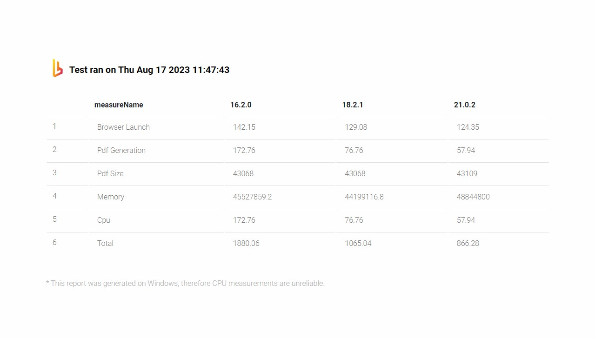
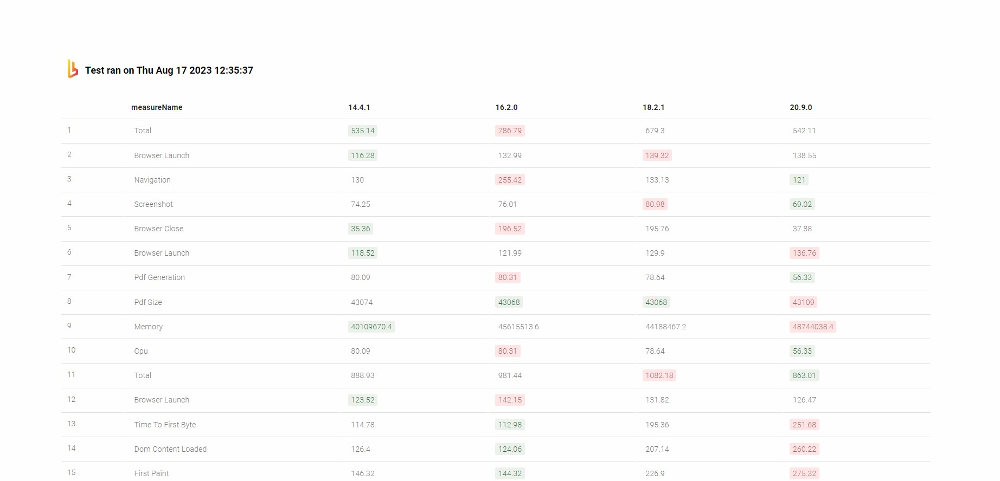

<!-- markdownlint-disable no-trailing-punctuation ul-style link-fragments no-inline-html -->

# Puppeteer Benchmark Tool

This project is a CLI to write, test, and benchmark versions of puppeteer (and their respective Chrome binaries) for workloads that you might be interested in. By default, it comes with three basic test-cases:

1. PDF Generation
2. Screenshot Generation
3. Load/paint events

Tests are simple async functions that make use of the `perf_hooks` library to capture events you're interested in. Feel free to fork and add your own!

- [Puppeteer Benchmark Tool](#puppeteer-benchmark-tool)
  * [Setting Up](#setting-up)
  * [Basic CLI usage](#basic-cli-usage)
  * [To install all versions](#to-install-all-versions)
  * [To test all versions](#to-test-all-versions)
  * [CLI options](#cli-options)
    + [run \<case\>](#run-case)
      - [Arguments](#arguments)
        * [-r, --retries-number \<number\>](#-r---retries-number-number)
        * [--puppeteer-versions \<string...\>](#--puppeteer-versions-string)
        * [--case-url \<url\>](#--case-url-url)
        * [--out \<filePath\>](#--out-filepath)
        * [--temp-dir \<tempDir\>](#--temp-dir-tempdir)
        * [--generate-report](#--generate-report)
        * [--highlight-html](#--highlight-html)
        * [--report-dir \<reportDir\>](#--report-dir-reportdir)
    + [prepare \<versions...\>](#prepare-versions)
    + [prepare-suite](#prepare-suite)
    + [suite](#suite)
  * [Why?](#why-)
  * [Future Features](#future-features)
  * [I want to Help!](#i-want-to-help-)

## Setting Up

```sh
# Install
$ npm i # add -g flag to install globally
$ npm run build

# Set up puppeteer versions
$ npx pptr-benchmark prepare 13 15 latest
# or install all versions
$ npx pptr-benchmark prepare-suite
```

## Basic CLI usage

```sh
# Run the tests and output the results to a JSON file
$ npx pptr-benchmark run test-cases/generate-pdf.js -r 2 --puppeteer-versions 13 15 latest --out results.json

$ npx pptr-benchmark run all -r 5 \
    --puppeteer-versions 13 15 latest \
    --case-url "http://example.com" \
    --out results.json
```

## To install all versions

```sh
npm run prepare-suite
```

## To test all versions

```sh
npm run suite
```

## CLI options

### run \<case\>

Runs a specific benchmark test. `<case>` must be one of the following cases: `all` | `generate-pdf.js` | `make-screenshot.js` | `paint-events.js`

```sh
# Will run PDF tests
npx pptr-benchmark run test-cases/generate-pdf.js
```

#### Arguments

##### -r, --retries-number \<number\>

Number of test exectuions. Defaults to `5`.

```sh
# Will average and aggregate results based on 2 runs
npx pptr-benchmark run all -r 2
```

##### --puppeteer-versions \<string...\>

Tests a list of puppeteer versions, separated by commas or spaces. Defaults to `latest`

```sh
# Will run all tests on pptr v13, v15 and latest
npx pptr-benchmark run all --puppeteer-versions 13 15 latest
```

##### --case-url \<url\>

Url that will be navigated to on the function. Defaults to `http://example.com/`.

```sh
# Will run all tests navigating to https://www.browserless.io/
npx pptr-benchmark run all --case-url https://www.browserless.io/
```

##### --out \<filePath\>

Writes json results to file.

```sh
# Will run all tests and write the results to ./file.json
npx pptr-benchmark run all --out ./file.json
```

##### --temp-dir \<tempDir\>

Writes testing PDFs and screenshots to directory.

```sh
# Will run all tests and save the PDFs files to ./cache
npx pptr-benchmark run all --temp-dir ./cache
```

##### --generate-report

Exports results as an HTML report

```sh
# Will run PDF tests on pptr v16, v18 and latest and generate a report
npx pptr-benchmark run all --puppeteer-versions 16 18 latest --generate-report
```

And generates the following report:



##### --highlight-html

Highlights min and max values in HTML report.

```sh
# Will run all tests on pptr v16, v18 and latest and generate a highlighted report
npx pptr-benchmark run all --puppeteer-versions 16 18 latest --generate-report
```

##### --report-dir \<reportDir\>

Writes the final HTML repor to directory

```sh
# Will run all tests on pptr v16, v18 and latest and generate a highlighted report on ./cache
npx pptr-benchmark run all --puppeteer-versions 16 18 latest --generate-report --report-dir ./cache
```

And generates the following report:



### prepare \<versions...\>

Downloads versions of puppeteer

```sh
# Will download pptr v13, v15 and latest
npx pptr-benchmark prepare 13 15 latest
```

### prepare-suite

Downloads and installs all major puppeteer versions.

```sh
# Will download all majr versions from v1 to latest
npx pptr-benchmark prepare-suite
```

### suite

Runs all tests with default arguments, on all available puppeteer versions. Easiest and most complete benchmark test.

```sh
# Will download all majr versions from v1 to latest
npx pptr-benchmark suite
```

## Why?

You can read more about why we did this in our blog. The TL;DR is that we (browserless) heard a lot from our users about performance changes from version-to-version of Chrome, and wanted a way to programmatically see if a version change would introduce new latencies.

This CLI was born from that curiosity, and we wanted to open-source it to the community so that you can write and run your own performance benchmarks to track KPIs that you care about.

## Future Features

Eventually we'll track the results of this suite into a static webpage that you can check on. This will hopefully give you a good sense of what to expect when upgrading. We'll work on adding newer tests as time goes on, but found enough value out of these initial few that we wanted to see what the community thought!

## I want to Help!

First, thanks! Please submit a PR and we'll follow up with you. If you have a bigger feature or want to do something drastic, please submit an issue describing what you want to do in order to avoid doing all that work.

---

<small><i><a href='http://ecotrust-canada.github.io/markdown-toc/'>Table of contents generated with markdown-toc</a></i></small>
